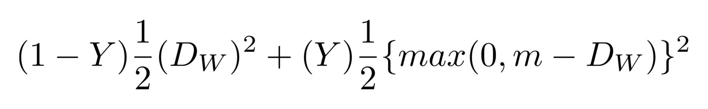

# DL_Siamese_Network_MNIST_Classification
This repository contains my implementation of Siamese Network, which purpose is MNIST digits classification.

Siamese Networks are designed to be especially good at solving *one shot classification* tasks. The Siamese architecture consists of two identical networks, whose weights
are shared, connected by their heads (just like siamese twins). All images belong to *hackernoon.com*.

The workflow is as follows:
1. Feed both networks with two different images.
2. Compute *contrastive loss* (more about it later).
3. Backpropagate loss through both networks.

The network's purpose is not to directly classify things, but rather to predict, wheter images belong to the same class. That is the *contrastive loss* for:

Dw stays for Euclidean distance between both networks outputs. 

In this project, networks consist of 3 convolutional layers, followed by 2 dense and one output layer. The network was trained on first 30 digits from each class of MNIST (which gives 300 images). I trained it on every possible pair (30x30=900 pairs), in only one pass. 

For more information, I encourage to read amazing these amazing articles:

https://hackernoon.com/one-shot-learning-with-siamese-networks-in-pytorch-8ddaab10340e

https://hackernoon.com/facial-similarity-with-siamese-networks-in-pytorch-9642aa9db2f7

https://www.cs.cmu.edu/~rsalakhu/papers/oneshot1.pdf

In case of any questions about the code or anything else, feel free to contact me at kar.piaskowski@gmail.com
